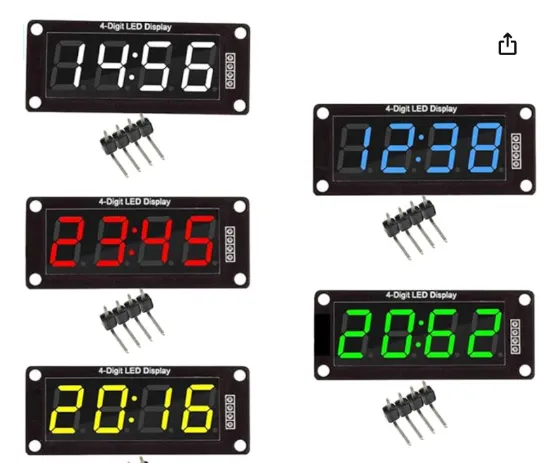
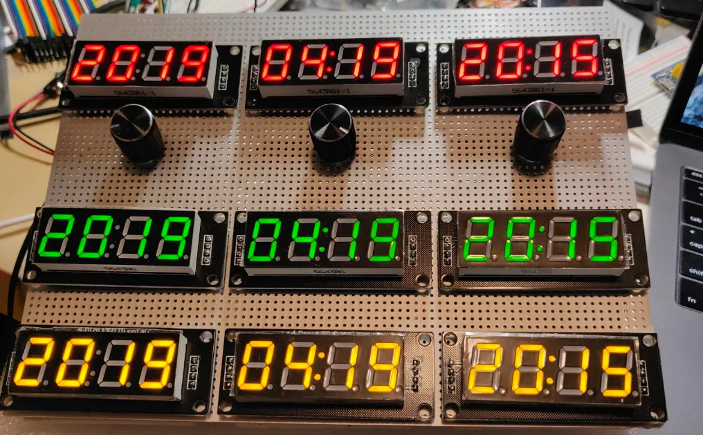
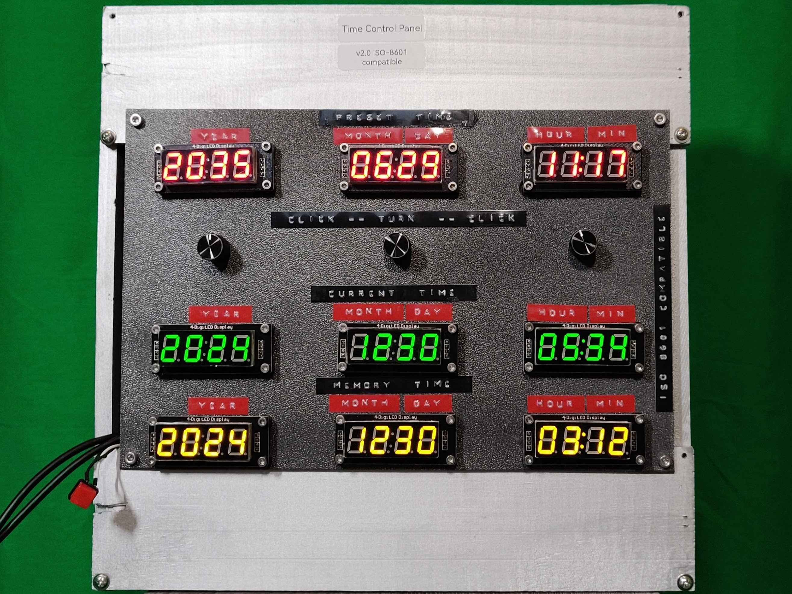
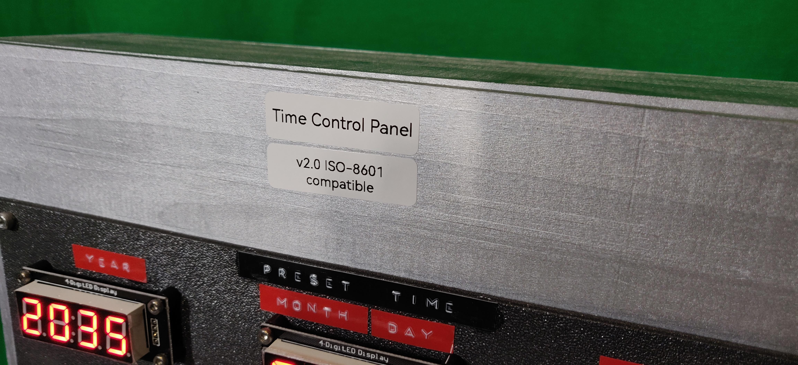
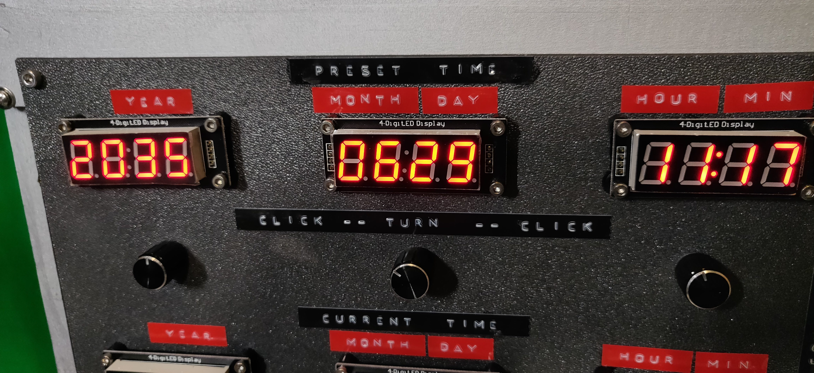
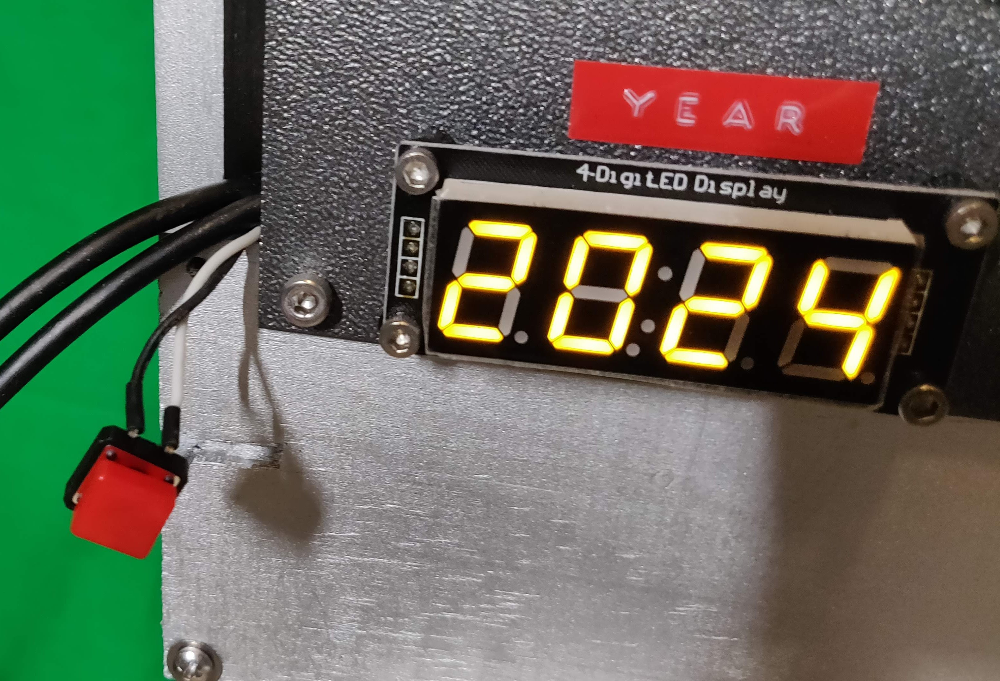
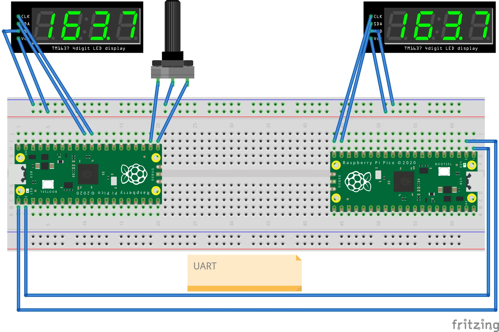
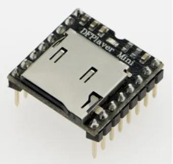

You know how it all started? I was browsing Amazon one day (as you do) and came across this set of color 7-segment LED displays.

Instantly, I thought of building colorful time displays with knobs to control them.

This project combines two of my favorite things — tech tinkering and fun. I used two Raspberry Pi Picos, some 7-segment LED displays, rotary encoders, and (of course) Go! And before you ask — yes, it does something cool, and no, I haven’t explored all its possibilities just yet.

This isn’t my first attempt at making this thing. I originally started with an Arduino, writing the project in C++. I even got as far as setting time with rotary encoders before life happened (probably work). It stayed unfinished for years.

Control Panel v1.0 (Arduino)

Version 2.0, though? That’s where things got interesting. I picked up TinyGo — a Go compiler for microcontrollers — and decided it was the perfect excuse to learn both TinyGo and Go while having fun. TinyGo works like a charm on Raspberry Pi Pico, so that became my hardware of choice.

Control Panel v2.0 (TinyGo and Raspberry Pi Pico)

## The Hardware

Here’s the gear I used:

- Two **Raspberry Pi Picos**
- 4-digit **7-segment LED** displays with the TM1637 chip
- **Rotary encoders** for setting the time (way more satisfying than buttons)
- **DFPlayer Mini** to play sound effects. Because what’s a time-travel toy without some audio drama?

The plan was simple: one Pico would set the “preset time,” and the other would handle the “current time” and “memory time.” When you press a button imitating the actual time travel, the “preset time” becomes your “current time,” and the fun begins. Sounds cool, right?

I decided I'll make a version which adheres to international standards, specifically ISO-8601
where the dates are presented in the form: `2024-12-30 15:04:05`.
(Well, the real reason was that I couldn't find alphanumeric LEDs that could display months 😉.)

## Why TinyGo?

Let’s be honest: when working with microcontrollers, the usual suspects are Arduino, MicroPython, or maybe CircuitPython. But with TinyGo, I got to work in Go — one of my favorite languages. It just made everything more enjoyable (and less tedious).

Here’s why TinyGo rocks:

- **Goroutines**: No more messing around with loops and managing every state yourself. With goroutines, the heavy lifting is done.
- **Channels**: These made it super easy to pass messages around without worrying about blocking the main thread. (Looking at you, Arduino.)

## How it all works

This setup has two brains (aka Raspberry Pi Picos) that talk to each other via UART. Here’s a rough idea of what’s going on:

1. **Left Pico**: You set the “preset time” using rotary encoders and 7-segment displays.
   You click the encoder and now you are in the "setting" mode.
   You turn the encoder to find the desired value.
   Then you click again and the value is set.
   For the date and hour:min displays you have to do it twice. For example, to set the date:

   - click
   - turn, find the month
   - click (the month is set)
   - turn, find the day
   - click (the day and the whole date is set)

  Of course, when you turn the month encoder is goes over 12 and starts with 1 again.
  Of course, the system knows how many days in each month and does the right thing.

2. **Right Pico**: It handles the “current time” and “memory time” and then updates the times when you hit the button to start the journey.

When you press the “time travel” button, the preset time is sent from the left Pico to the right Pico as an RFC3339 string (fancy, huh?). Then, the present time becomes the new “memory time” — you know, just in case you want to go back to the exact moment you left.

Hardware connections

## Software Shenanigans

I kept the code simple but flexible. I used goroutines to handle multiple tasks at once — like updating the display while you’re setting the time — and channels to manage button presses and other events without creating a tangled mess of code.

Here’s the basic rundown:

- You turn the rotary encoder to set the year, month, and day for the preset time.
- The left Pico sends that data over UART to the right Pico.
- When you press the time-travel button, the current time is saved in the “previous” time, and the time set as the target becomes your current time.
- The present time starts ticking as your typical wall clock.

## Extra fun stuff: sound and memory

Because time travel needs sound effects (obviously), I hooked up a DFPlayer Mini. It plays MP3s from an SD card, and the Picos send the player commands over UART.

Oh, and the toy remembers your settings. Every second, the times are saved to flash memory. When you power it back on, the Picos pick up right where they left off. Handy, right?

DFPlayer Mini

## Lessons I didn’t expect to learn

This project was a great learning experience but it wasn’t all smooth sailing. Here are some of the surprises I encountered:

1. **Goroutines**: In TinyGo, goroutines will keep going until they hit a blocking operation (like I/O). I had to add tiny sleep calls here and there to make everything work smoothly.

1. **Error handling matters**: Error handling is always important, but it’s really important here. Things will go haywire if an extra character sneaks into your UART transmission. You must detect it and avoid just hanging up the whole time machine.

1. **Rotary encoders are not so simple**: I learned about Gray code (have you heard about it?) to implement the rotary encoders, which saved me from a world of trouble. In short, it’s an alternative binary code where two consecutive numbers differ only by one bit. It turns out to be very useful in error-prone environments like electronic circuits. Read more: https://en.wikipedia.org/wiki/Gray_code.

1. **Debouncing switches**: That’s a whole other world of engineering. When you pressed a button, did it send just one pulse or more? If you’re going down that rabbit hole, here are some excellent reads on switch debouncing: https://www.eejournal.com/article/ultimate-guide-to-switch-debounce-part-1/ and http://www.ganssle.com/debouncing.htm.

## What’s next?

There are so many ways I can build on this project. For starters, I could turn this into a Pomodoro timer, an alarm clock, or a chess clock — time-related toys for all occasions.

Or, who knows? Maybe I’ll create a DIY kit so you can build your own time-travel toy at home.

## Want to try TinyGo?

If you’re curious about TinyGo and want to dip your toes in, here’s how to start:

1. Get a Raspberry Pi Pico Starter Kit — it usually includes sensors, motors, LEDs, and more.
1. Clone the TinyGo repo: https://github.com/tinygo-org/tinygo
1. Follow the steps here: https://tinygo.org/getting-started/

Trust me, it’s a fun way to learn Go, and you’ll get something you can actually hold and show off to your friends.

Please let me know if you need more details about this project. Or if you have ideas about improving it — I’ll be happy to continue working on it!
