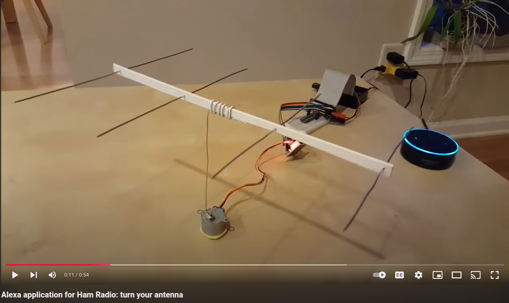
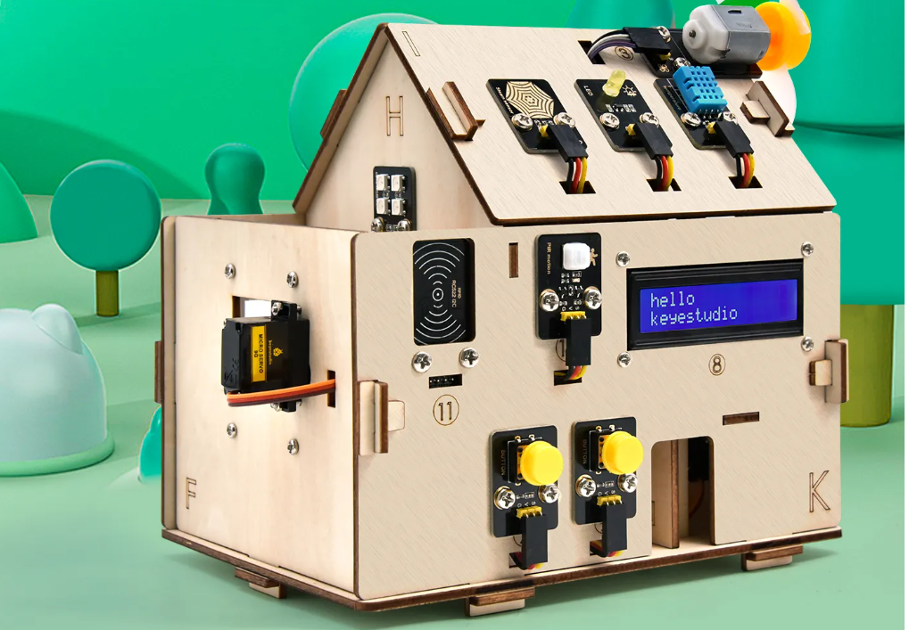

## Previously

It all started several years ago when I thought "Can I use Alexa to manage physical devices?"
I created a simple demo project to show it to my amateur radio friends.
You would say, "Alexa, turn my antenna 90 degrees," and my model antenna would magically turn.
It was a fun weekend project that used a Raspberry Pi, a stepper motor, and a miniature model antenna.
I published it on YouTube, if you're curious.



## Smart dollhouse

The Alexa experiment was great but had some issues.
With Alexa, you should be very precise with your phrases.
In my application, Alexa expected you to say, "Alexa, turn my antenna XX degrees," and only this exact phrase would work.
With the growing availability of large language models (LLM) I started thinking about using them to manage motors, devices, and sensors.

"What if I get a dollhouse," I thought, "and add a bunch of sensors and a microcontroller and write a REST API server for them?"
Then, I'll ask an LLM to convert human language to REST API requests and send them to the server.
Also, I wanted something that looks realistic and not just a bunch of sensors scattered on my desk.

Luckily, I found _exactly_ what I needed on Amazon: a wooden house with many of sensors attached to it and a microcontroller.
I have to praise the great quality of the kit I bought from Keyestudio: it was very easy to build and attach the sensors, and the
software worked on the first run!
If you tried similar kits before, you should know it's not very common.



The kit included a simple Arduino controller with a sample program that implemented some business logic: for example,
when there was a signal on the rain sensor on the roof, the servo motor would close the window.

It worked fine, but I needed a server to respond to remote requests.

## IoT server

I decided to switch to Raspberry Pi Pico W and MicroPython.
The "W" version of Pico gave me the connectivity I needed, and I was going to use MicroPython to implement a simple REST API server.

### Using AI helpers

As it's becoming more common these days, I asked Claude.ai to help me with this project.

> I want to write a program in MicroPython for Raspberry Pi Pico. It should run a web server connected to WiFi.
> The web server should accept REST requests and perform actions on the Pico, such as: getting information from sensors, turning LEDs on and off, turning motors (servos and steppers) on and off.
> Please help me create an API for this application.

Claude answered with a list of `curl` commands that can be used against our planned API.
I liked this approach: you design the expected user experience first (in our case, it was REST API) and then start implementing it.

It created a very simple web server without using any frameworks at all, just with sockets.
I asked if we can use a framework like Flask, and Claude told me that with MicroPython it's more common to use Microdot
because it is lighter on resources.
I learned that Microdot is being developed by Miguel Grinberg, the author of one of the most popular books about Flask.
That was a good recommendation and I asked Claude to re-write the web server with Microdot.

After that was done, I tested the server on my Pico and it worked just fine!
But I had a further idea, and I asked:

> Please help me write the GET function for Microdot that will return a list of sensors when called as `/sensors` and the sensor's value when called with /sensors/id.
> I think this should help with discoverability.

And here was another discovery!
Claude told me about the concept with a strange name "HATEOAS," which stands for Hypermedia as the Engine of Application State.
It explained the idea behind it, gave examples, and finally, wrote the server code that would respond to routes like `/sensors` or `/leds` with
the information about sensors and LEDs locations (roof, garden, door), parameters (LED's color, sensor's calibration),
and, most importantly, the links I should use to work with them.

That was very close to what I needed.

## Using LLM to generate REST API calls

Now, thanks to Claude's help, I had a server that would respond to requests like `curl http://server/leds` with the following JSON:

```json
{
  "_links": {
    "filter_by_color": {
      "href": "/leds/filter?color={color}",
      "templated": true
    },
    "self": {
      "href": "/leds"
    },
    "filter_by_location": {
      "href": "/leds/filter?location={location}",
      "templated": true
    }
  },
  "data": {
    "1": {
      "color": "yellow",
      "location": "roof",
      "state": 0,
      "_links": {
        "on": {
          "href": "/leds/1/on"
        },
        "self": {
          "href": "/leds/1"
        },
        "off": {
          "href": "/leds/1/off"
        },
        "toggle": {
          "href": "/leds/1/toggle"
        }
      }
    },
    "2": {
      "color": "white",
      "location": "garden",
      "state": 0,
      "_links": {
        "on": {
          "href": "/leds/2/on"
        },
        "self": {
          "href": "/leds/2"
        },
        "off": {
          "href": "/leds/2/off"
        },
        "toggle": {
          "href": "/leds/2/toggle"
        }
      }
    }
  }
}
```

What if I get similar JSONs from the other routes, such as `/sensors` and `/motors`, send them to an LLM, and ask it to convert human requests to `curl` commands?
Then, I can send those commands to the server via the `requests` Python library and work with the devices!

The next step was to write a simple Python script that would get the initial links from the root (`/`) route of the server and explore all links to get the same JSONs from them.

After the script collected the API description of the server this way, I created a system prompt that included the whole JSON with all the links from the server and added the request:

```text
You are an IoT API assistant.
Convert user commands to curl commands for the IoT server.
API structure: {json.dumps(self.api_structure, indent=2)}
Server URL: {self.server_url}

Respond only with the curl command, no explanations.
```

Then I created a simple dialog that would get the command from the user in human language, attach it to the prompt, and send it to the LLM.

For this application, I used Haiku-3.5 from Anthropic because it is faster and cheaper than more complex models.

## Translate JSON responses to human language

Now the system has started working.
I would send a message like, "Turn the yellow LED on," and it turned on.
Or, "Turn the garden LED on," and the white LED in the garden would turn on.
I could ask in normal language, "What's the light conditions on the roof?" and it responded with a JSON that included a lot of information:

```json
{
  "_links": {
    "config": {
      "href": "/sensors/2/config"
    },
    "self": {
      "href": "/sensors/2/value"
    },
    "all_sensors": {
      "href": "/sensors"
    },
    "sensor": {
      "href": "/sensors/2"
    }
  },
  "data": {
    "unit": "lux",
    "type": "light",
    "calibrated_value": 4114.6,
    "location": "roof",
    "id": "2",
    "raw_value": 41146
  }
}
```

That was good, but I wanted more reasonable human language instead of JSON!
LLM was to the rescue again!
Here is another prompt for Haiku:

```text
Convert this IoT API JSON response to concise human language, focusing on the most important information.
Don't print 'Here is the concise summary' or other explanations; print just the content:
```

And now the answers from my server looked like:

```text
Light sensor #2 located on the roof is measuring 4,109.8 lux, indicating bright illumination conditions.
```

## First public demo

Recently, I went to the local Python meetup in Atlanta.
I was going to give a presentation about this project and demonstrate it.
Needless to say, I was nervous.

I started a hotspot on my cell phone, connected my laptop to it, and started the Pico.
It indicated that it had connected to the hotspot and got an IP address.
Now I had to change my dialogue program to point to that address.

The dialogue began:

```none
IoT Controller started. Type 'quit' to exit.

>>> turn the yellow led on

LED 1 is currently on, colored yellow, and located on the roof.

>>> turn the motor on

Motor 1 (DC type) is currently ON and located on the roof.

>>> turn the motor off

Motor #1, a DC motor located on the roof, is currently turned off.
```

So far, so good.
The public loved it when the propeller started spinning and gave me a round of applause.

I switched my keyboard to Cyrillic and typed this:

```text
>>> выключи желтый led
```

"Wow, is it Russian?" I heard the murmur in the audience.

And magic happened. The LED went off, and I got this message:

```text
LED 1 located on the roof is yellow and currently off (state 0).
```

I asked the meetup organizer, "Pablo, can you tell it in Spanish to turn the LED on?"

Pablo took the keyboard and typed:

```text
>>> Por favor prender el LED amarillo

LED 1 is currently on (state 1), colored yellow, and located on the roof.

>>> Apaga la maldita led amarilla

LED 1 is currently off, located on the roof, and colored yellow.

>>>
```

"Wow!" said the audience.

I explained, "This magic is done purely by the LLM. I didn't do anything in the code.
It understands many languages and translates between them and REST and JSON easily.
Note that when I spoke to it in Russian, I used the English word 'LED', and it understood me perfectly."

## Lessons Learned

This project turned out to be an unexpected learning journey.
I started with a simple idea of controlling a dollhouse but ended up learning:

- MicroPython and its differences from regular Python
- Microdot - a lightweight web framework perfect for microcontrollers
- HATEOAS - a REST API design principle with a name that sounds like a sneeze
- The incredible versatility of LLMs in handling natural language processing

Most importantly, I learned that AI assistants like Claude can be excellent coding partners.
They not only help with code but also introduce you to best practices and concepts you might not have discovered otherwise.

## Future plans

Of course, I started looking for ways to expand the project.
And, of course, I found this: a huge 42-in-1 kit from Keyestudio with a lot of sensors and actuators.

Wouldn't it be cool to say something and have it displayed on the LCD screen?
Gas sensors, accelerometers, buzzers, and motors are waiting for me to connect them.

## Getting more serious

Of course, it's just a toy project created for learning.
If you want to use IoT in your real home, of course, you should take a look at [Home Assistant](https://www.home-assistant.io/).
That's what I did, thinking, "Can I apply the same approach to creating Home Assistant's API requests?"
Needless to say, the project has already implemented the [API for LLMs](https://developers.home-assistant.io/docs/core/llm/)
"Great minds think alike," I said to myself proudly. 😉

## Project code

If you're interested in building your own multilingual smart dollhouse (or just want to see how it all works), check out the project on GitHub: [Geekhouse Repository](https://github.com/pavelanni/geekhouse). Feel free to contribute, ask questions, or share your own IoT adventures.

Try to use any language you know and see if the LLM can translate it into REST API calls!
Try other LLMs, try a local LLM running in your homelab.
Most likely, using a local LLM will make turning LEDs on and off faster.
