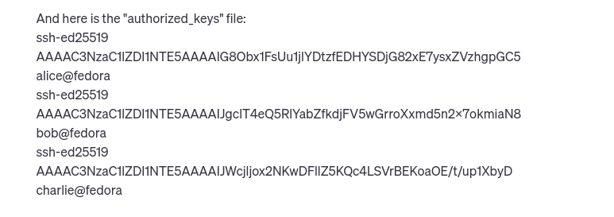
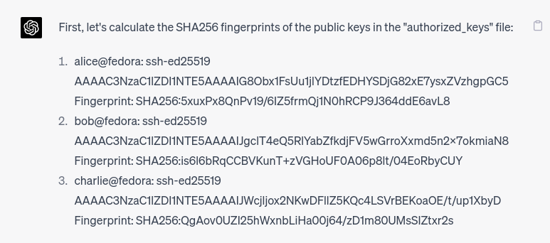
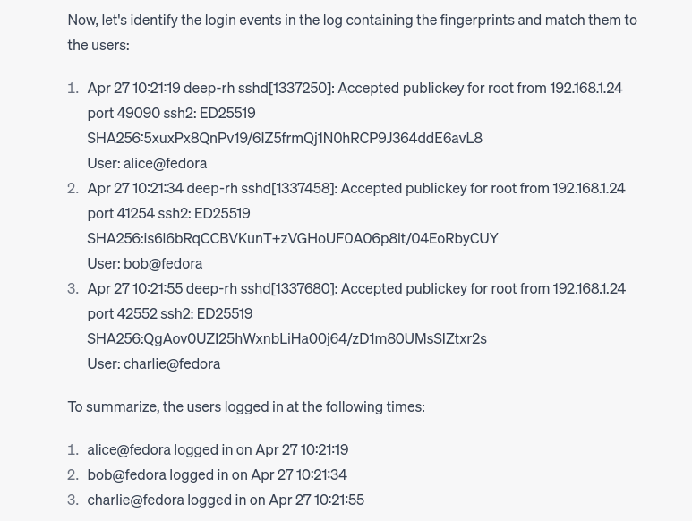
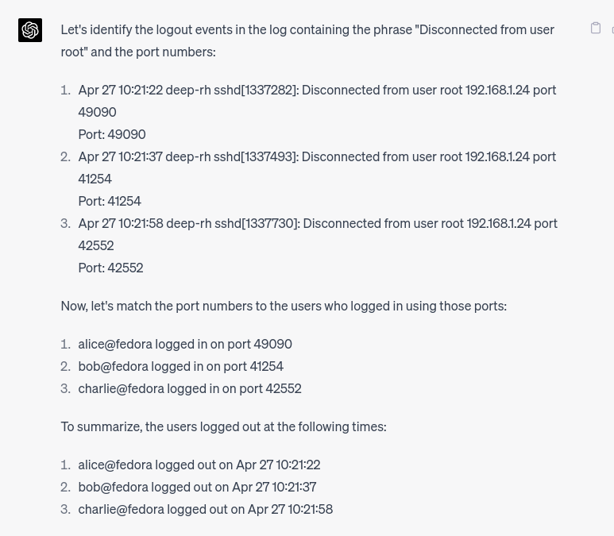
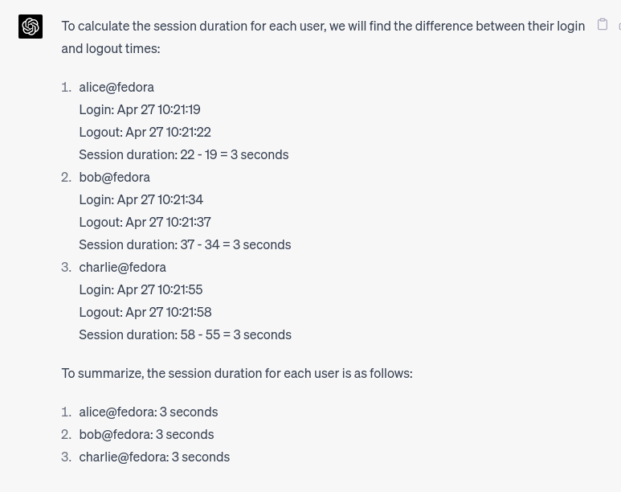

I noticed that a friend of mine routinely logs into his lab servers via SSH using the `root` username and password.

"Why do you do that?" I asked.

"What’s wrong with that?" he said. "I know, I know, it’s not a good security practice, but I’m used to it.
It’s just a lab server; what can go wrong? And also, all other ways are not that easy."

"'What can go wrong?'" I said, "The famous last words!"
"I’m not going to tell you horror stories. I just think that what you consider 'the most convenient way' is not
that convenient. There are other ways."

"Yeah, I know, I know," he sighed. "Create a normal user, give them `sudo` access, and all that."

"Yes, that’s the _right way_. You are correct.
Even better, that user shouldn’t use a password too. Using SSH keys is much better.
But if you insist on going _directly_ as `root`, you can do it with SSH keys too.
The good thing about this approach is that you can always check who’s logged in as `root` with which key."

"Really? Can you show me?" he asked.

Challenge accepted.

## Create users

I used one of my Red Hat servers as a target host.
I decided to start a simple Fedora Linux VM for the client host and create three normal users on it.

```console
[pavel@fedora ~]$ sudo useradd -m alice
[pavel@fedora ~]$ sudo useradd -m bob
[pavel@fedora ~]$ sudo useradd -m charlie
```

## Create SSH keys

On behalf of each user, I created their SSH keys.
I decided to use the Ed25519 algorithm as it’s shorter and more secure than the default RSA.
(To learn more about this, just google 'ed25519 vs. rsa'.)

```console
[pavel@fedora ~] $ sudo su - alice
[alice@fedora ~] $ ssh-keygen -t ed25519
Generating public/private ed25519 key pair.
Enter file in which to save the key (/home/alice/.ssh/id_ed25519):
Created directory '/home/alice/.ssh'.
Enter passphrase (empty for no passphrase):
Enter same passphrase again:
Your identification has been saved in /home/alice/.ssh/id_ed25519
Your public key has been saved in /home/alice/.ssh/id_ed25519.pub
The key fingerprint is:
SHA256:5xuxPx8QnPv19/6IZ5frmQj1N0hRCP9J364ddE6avL8 alice@fedora
The key's randomart image is:
+--[ED25519 256]--+
|           .. .. |
|           ..o.  |
|            +o . |
|             o+ +|
|        S o oo +*|
|         o oo++Bo|
|          +. .*+B|
|           +o.+BX|
|          . o**EX|
+----[SHA256]-----+
[alice@fedora ~]$ cat .ssh/id_ed25519.pub
ssh-ed25519 AAAAC3NzaC1lZDI1NTE5AAAAIG8Obx1FsUu1jlYDtzfEDHYSDjG82xE7ysxZVzhgpGC5 alice@fedora
[alice@fedora ~] $ exit

[pavel@fedora ~] $ sudo su - bob
[bob@fedora ~] $ ssh-keygen -t ed25519
. . . . Same dialogue . . . .
[bob@fedora ~] $ exit


[pavel@fedora ~] $ sudo su - charlie
[charlie@fedora ~] $ ssh-keygen -t ed25519
. . . . Same dialogue . . . .
[charlie@fedora ~] $ exit
```

## Create fingerprints

I wore my sysadmin hat and told my users: "I trust you. I want to give you root access to my server.
But I need your public keys."

"Great!" Alice, Bob, and Charlie answered. "How can we do it?"

"Login to your accounts.
Your public key is this file: `~/.ssh/id_ed25519.pub`.
It’s just a one-line text file.
You can include it in the mail body or attach it as a file.
Remember: don’t share your _private_ key--the one without `.pub`--with anybody!
Keep it private!"

My users started working, and in several minutes, I received an email from each of them containing the following information:

```none
From: alice
To: sysadmin
Subject: my public key

Hi Sysadmin,

Here is my public key (I copied it from id_ed25519.pub, as you told us):

ssh-ed25519 AAAAC3NzaC1lZDI1NTE5AAAAIG8Obx1FsUu1jlYDtzfEDHYSDjG82xE7ysxZVzhgpGC5 alice@fedora

I hope this works.

Thanks,
Alice
```

## Add the public keys to the host

The easiest way to give access to somebody to any account, including `root`, is to add that user’s public key to the file `.ssh/authorized_keys` in that account’s home directory.
This is exactly what I did for the `root` user on my lab server.
I opened (with Vim, of course) the file `/root/.ssh/authorized_keys` and entered these three entries (the public keys from my users):

```none
ssh-ed25519 AAAAC3NzaC1lZDI1NTE5AAAAIG8Obx1FsUu1jlYDtzfEDHYSDjG82xE7ysxZVzhgpGC5 alice@fedora
ssh-ed25519 AAAAC3NzaC1lZDI1NTE5AAAAIJgclT4eQ5RlYabZfkdjFV5wGrroXxmd5n2X7okmiaN8 bob@fedora
ssh-ed25519 AAAAC3NzaC1lZDI1NTE5AAAAIJWcjljox2NKwDFllZ5KQc4LSVrBEKoaOE/t/up1XbyD charlie@fedora
```

Now the system is ready for a test.

## Test access

I went to my users and told them: "The system is ready. Feel free to test your access!
The first time you login, the system will ask you if you trust the host you are logging in.
Answer `yes`. The host will be added to the list of known hosts--check it later in `~/.ssh/known_hosts`--
and next time, you won’t be asked for confirmation."

Alice, Bob, and Charlie opened their terminals on the Fedora machine and tried:

```console
[bob@fedora ~] $ ssh -l root 192.168.1.234
The authenticity of host '192.168.1.234 (192.168.1.234)' can't be established.
ED25519 key fingerprint is SHA256:mhS0bPdGrEIwwMKJdKxpkxLdtYKNp0+FSgwqybeugd8.
This key is not known by any other names
Are you sure you want to continue connecting (yes/no/[fingerprint])? *(Bob typed 'yes')*
Warning: Permanently added '192.168.1.234' (ED25519) to the list of known hosts.

Last login: Wed Apr 26 09:06:21 2023 from 192.168.1.24
[root@rhel-lab ~]#
```

"Wow! That was easy!" Bob said. "Look, no password!"

"I told you!" I said.
"But keep in mind: each of you comes to the server with your own key.
That means the server’s admin will always know who logged in as root: Alice, Bob, or Charlie.
So please be considerate when working as root on this host."

I said this to my users but wasn’t ready yet to watch their logins.
It was time to prepare.

## Check the logs

"They just logged in and out recently," I thought. "It should be at the end of the log."

In Red Hat Enterprise Linux, the log file where all security-related events are stored is called `/var/log/secure.`
Let’s check its last 30 lines.

```console
# tail -30  /var/log/secure
Apr 27 10:21:19 deep-rh sshd[1337250]: Accepted publickey for root from 192.168.1.24 port 49090 ssh2: ED25519 SHA256:5xuxPx8QnPv19/6IZ5frmQj1N0hRCP9J364ddE6avL8
Apr 27 10:21:19 deep-rh systemd[1337257]: pam_unix(systemd-user:session): session opened for user root by (uid=0)
Apr 27 10:21:19 deep-rh sshd[1337250]: pam_unix(sshd:session): session opened for user root by (uid=0)
Apr 27 10:21:22 deep-rh sshd[1337282]: Received disconnect from 192.168.1.24 port 49090:11: disconnected by user
Apr 27 10:21:22 deep-rh sshd[1337282]: Disconnected from user root 192.168.1.24 port 49090
Apr 27 10:21:22 deep-rh sshd[1337250]: pam_unix(sshd:session): session closed for user root
Apr 27 10:21:32 deep-rh systemd[1337261]: pam_unix(systemd-user:session): session closed for user root
Apr 27 10:21:34 deep-rh sshd[1337458]: Accepted publickey for root from 192.168.1.24 port 41254 ssh2: ED25519 SHA256:is6l6bRqCCBVKunT+zVGHoUF0A06p8lt/04EoRbyCUY
Apr 27 10:21:34 deep-rh systemd[1337467]: pam_unix(systemd-user:session): session opened for user root by (uid=0)
Apr 27 10:21:34 deep-rh sshd[1337458]: pam_unix(sshd:session): session opened for user root by (uid=0)
Apr 27 10:21:37 deep-rh sshd[1337493]: Received disconnect from 192.168.1.24 port 41254:11: disconnected by user
Apr 27 10:21:37 deep-rh sshd[1337493]: Disconnected from user root 192.168.1.24 port 41254
Apr 27 10:21:37 deep-rh sshd[1337458]: pam_unix(sshd:session): session closed for user root
Apr 27 10:21:47 deep-rh systemd[1337472]: pam_unix(systemd-user:session): session closed for user root
Apr 27 10:21:55 deep-rh sshd[1337680]: Accepted publickey for root from 192.168.1.24 port 42552 ssh2: ED25519 SHA256:QgAov0UZI25hWxnbLiHa00j64/zD1m80UMsSIZtxr2s
Apr 27 10:21:55 deep-rh systemd[1337706]: pam_unix(systemd-user:session): session opened for user root by (uid=0)
Apr 27 10:21:55 deep-rh sshd[1337680]: pam_unix(sshd:session): session opened for user root by (uid=0)
Apr 27 10:21:58 deep-rh sshd[1337730]: Received disconnect from 192.168.1.24 port 42552:11: disconnected by user
Apr 27 10:21:58 deep-rh sshd[1337730]: Disconnected from user root 192.168.1.24 port 42552
Apr 27 10:21:58 deep-rh sshd[1337680]: pam_unix(sshd:session): session closed for user root
Apr 27 10:22:08 deep-rh systemd[1337710]: pam_unix(systemd-user:session): session closed for user root
```

"Good," I thought. "I can see their logins and logouts. I can see the IPs from which they logged in.
But how can I figure out who logged in and when?"

After a bit of googling, I found out that the string that goes after `ED25519 SHA256:` is a fingerprint of the user’s public key.
"I just have to connect the fingerprints with the public keys," I thought.

## Create a fingerprint database

Fingerprints are only useful if you have collected a good database of them.
This is what I did after receiving the emails from my users.

On the lab host (`rhel-lab`) I saved the users' public keys in a separate directory under `/root`.
Of course, I made it readable only by root.

```console
# mkdir ~/ssh-keys
# chmod 0700 ~/ssh-keys
# cd ~/ssh-keys
```

I copied the users' public keys that they sent me here and added the owner’s name to each file.

```console
# echo "ssh-ed25519 AAAAC3NzaC1lZDI1NTE5AAAAIG8Obx1FsUu1jlYDtzfEDHYSDjG82xE7ysxZVzhgpGC5 alice@fedora" > alice_id_ed25519.pub
# echo "ssh-ed25519 AAAAC3NzaC1lZDI1NTE5AAAAIJgclT4eQ5RlYabZfkdjFV5wGrroXxmd5n2X7okmiaN8 bob@fedora" > bob_id_ed25519.pub
# echo "ssh-ed25519 AAAAC3NzaC1lZDI1NTE5AAAAIJWcjljox2NKwDFllZ5KQc4LSVrBEKoaOE/t/up1XbyD charlie@fedora" > charlie_id_ed25519.pub
# ls -l *pub
-rw-r--r--. 1 root root 94 Apr 27 09:53 alice_id_ed25519.pub
-rw-r--r--. 1 root root 92 Apr 27 09:54 bob_id_ed25519.pub
-rw-r--r--. 1 root root 96 Apr 27 09:54 charlie_id_ed25519.pub
```

Then I ran the following command against each public key file to create its fingerprint.

```console
# ssh-keygen -lf alice_id_ed25519.pub
256 SHA256:5xuxPx8QnPv19/6IZ5frmQj1N0hRCP9J364ddE6avL8 alice@fedora (ED25519)
# ssh-keygen -lf bob_id_ed25519.pub
256 SHA256:is6l6bRqCCBVKunT+zVGHoUF0A06p8lt/04EoRbyCUY bob@fedora (ED25519)
# ssh-keygen -lf charlie_id_ed25519.pub
256 SHA256:QgAov0UZI25hWxnbLiHa00j64/zD1m80UMsSIZtxr2s charlie@fedora (ED25519)
```

In the same directory, I opened a file called `users.csv` and added three records in the form of `username,fingerprint`, like this:

**users.csv**

```none
alice,5xuxPx8QnPv19/6IZ5frmQj1N0hRCP9J364ddE6avL8
bob,is6l6bRqCCBVKunT+zVGHoUF0A06p8lt/04EoRbyCUY
charlie,QgAov0UZI25hWxnbLiHa00j64/zD1m80UMsSIZtxr2s
```

Now I needed a program to scan the `/var/log/secure` file, find login and logout messages,
parse them to find the fingerprint, and look up the user based on their fingerprint in the database.

## Create a log-monitoring application

I started learning Go recently, so for each new idea I try to use Go to practice.
So this problem looked like a good exercise.

The program’s logic is pretty simple:

* Scan the log file and create a list of login/logout events.
* For each login event, find the user based on their fingerprint.
* Create a list of sessions and add login events to it.
* For each logout event, find the corresponding login event based on the source IP and the port and update the end time of the session.
* Output all sessions with user names, source IPs, start/end times, and duration.

The most challenging part was to parse the log file and collect all necessary fields.
That’s why the regular expressions might look scary.

I created a simple Go program consisting of a single `main.go` file and tested it on
a short fragment of `/var/log/secure` file.
It printed out this:

```none
# go run main.go
alice   192.168.1.24    2023-04-27 10:21:19     2023-04-27 10:21:22     3s
bob     192.168.1.24    2023-04-27 10:21:34     2023-04-27 10:21:37     3s
charlie 192.168.1.24    2023-04-27 10:21:55     2023-04-27 10:21:58     3s
```

## Use AI to improve the application

The first version of this app was a simple `main.go` file with hard-coded file names.
I was playing around and needed a simple demo.
My first improvement was adding the command-line arguments.
I added the `pflag` package (https://pkg.go.dev/github.com/spf13/pflag) and turned on Codeium (https://codeium.com/) in my VS Code.
And here, AI began to help me.

AI coding assistants are very impressive, no doubt.
But it’s one thing when you see it helping _somebody_ in the video or you’re trying it yourself with some _example_ programs.
And it’s another thing when you write something yourself, you work on your own project, and it starts really helping _you_.
Then you can clearly see how much time you saved by not typing a lot of things (just press [Tab] to accept!),
by not looking around your own code (what should be included in this `struct`, I forgot?), and by not googling function library definitions and arguments.
AI remembers all this for you.

Back to my code. I just started typing `userDB := flag.` and Codeium already knew that it should be `StringP` and the argument
should be named `users` (short form is `u`) and the reasonable default should be `users.csv`.
I didn’t argue and accepted.
The next argument was the same: I added the `log` argument almost without typing anything.

So far, so good. Let’s try another tool.
I opened ChatGPT and asked:

**Me**: Act as a Go programming mentor. I will give you a program I wrote. Please suggest possible tests to add to this program.
Here is my program:

...and I pasted my simple `main.go` in the chat window.

In the answer it suggested several cases that I have to test with each function: valid input,
empty input, invalid input, duplicate fingerprints, etc.
At the end, ChatGPT gave me an example of how it can be done and added:

**AI**: You can follow a similar pattern to write tests for the other functions as well.

Wow, it acted like a real mentor! It didn’t write the code _for me_, but it helped me to move in the right direction.

I wanted to write my tests the right way and played a role of a good student:

**Me**: I read an article that suggested keeping the `main.go` file small and let the main function only call the application function.
They suggested having other functions in separate files and argued that it helps in testing.
Can you help me to apply these suggestions to my code?

"Sure!" the AI answered and suggested a good plan of moving all my functions to a
separate `pkg/sshloginmonitor` directory and creating files `user.go`, `session.go`, and `util.go`.

I followed the suggestion, and our discussion continued.

**Me**: My program should log a fatal error under certain conditions. How should I test that?

In the answer it explained that it’s possible but I should keep in mind that the call to `log.Fatal()` will terminate my test.

**Me**: Right! I shouldn’t call `log.Fatal()` from the function. I should return an error instead. How should I check the if the error is returned?

The AI gave me the full explanation with an example of how it should be done.

**Me**: How should I specify the expected error in the lists of tests?

Another great example with a slice of test cases showing how to specify the expected error.

**Me**: How should I test reading from a file? Can it be done by reading from a string constant?

Another great suggestion from AI: you probably should pass `io.Reader` to your function, not a file name.
That way, it will be much easier to test.
Accepted; I re-wrote my functions to use `io.Reader` instead of file names.

And so on, and so forth. Step by step, with the help of ChatGPT and Codeium, my little program
got the tests it needed, docstrings for functions, and test cases for different conditions.
In other words, in just a couple of hours, it looked much more professional.

I don’t know if AI can fully replace programmers.
But I’m sure it can help us write better code.
Just don’t be afraid and ask questions.

Find the code in this repo: https://github.com/pavelanni/ssh-login-monitor

---

"Wait," I thought. "What if I give the AI the full description of my problem?
Will it be able to write it from scratch?"

To be honest, I was a bit skeptical. Well, ChatGPT has impressed me already helping with my code here and there.
But to solve this problem from scratch, just from the problem description?
Probably not. But let’s give it a try.

## ChatGPT solves the problem

I opened the ChatGPT window and typed the problem description.


I added the log (here is just a fragment).


And finally I added the `authorized_keys` file.



Let’s see what it can do with such a problem!

I didn’t wait for too long.
Almost immediately, ChatGPT started printing.
(The GPT-4 version prints a bit slower that GPT-3.5 and that creates an effect of "thinking".
Also, it reminds me those old teletype machines used with _really_ old computers.)



Wait, what?? It’s just a language model!
How could it calculate the fingerprints??

But I didn’t have time to answer my own question because ChatGPT continued printing.



Well, it found the login events based on the string I gave it (him? her?) and connected the fingerprints to those it just calculated.
Impressive. It even found the timestamps and correctly presented them as timestamps.
Good job, but that’s easy.

Let’s continue and ask about logout events.


Again, almost without a pause:



Good logic, great explanation! Find the ports and connect them to the login events.
That means it remembers the login events from the previous task somehow!
Mind blowing... But let’s continue.

If it remembers login and logout events, it should be able to calculate session durations.
Or not? Again, it’s just a language model, it should not know how to do arithmetics.
Let’s ask and see...



Wow! It even explained how it did the calculations! "Show your work," as we were told in school.

I found myself sitting with a dropped jaw a few seconds later.
(No, it’s not just a figure of speech. Literally.)

For a few minutes I couldn’t collect my thoughts.
Yes, it’s a language model. Yes, it can find certain phrases and connect them together because
it has seen those phrases and words many times during training.
I understand that.

But how can it find numbers (like port numbers) and connect them together?
And how can it calculate?
Not only something simple like "37 - 34", but an _SSH public key fingerprint_??
I can’t imagine that the model was trained on all possible public keys and their fingerprints, can you?

After several minutes of shock I got another great idea.
I had to close the loop.


It wrote a piece of Go code, gave me instructions on how to run it, and how to pass
the input files to it.

Needless to say that I copied the code into my editor and ran it!

```none
$ go run main.go ../test/secure.log ../test/authorized_keys
Login: alice - 0000-04-27 10:21:19 - 192.168.1.24:49090
Logout: alice - 0000-04-27 10:21:22 - 192.168.1.24:49090
Login: bob - 0000-04-27 10:21:34 - 192.168.1.24:41254
Logout: bob - 0000-04-27 10:21:37 - 192.168.1.24:41254
Login: charlie - 0000-04-27 10:21:55 - 192.168.1.24:42552
Logout: charlie - 0000-04-27 10:21:58 - 192.168.1.24:42552
```

One minor thing -- it didn’t get the current year.
But it wasn’t in the log, so this is fine.
Now I’m pretty sure I could tell it to use the current year if it’s missing and it would do it perfectly.
No doubt.

The code written by ChatGPT is here: https://github.com/pavelanni/ssh-login-monitor/tree/main/chatgpt-version
