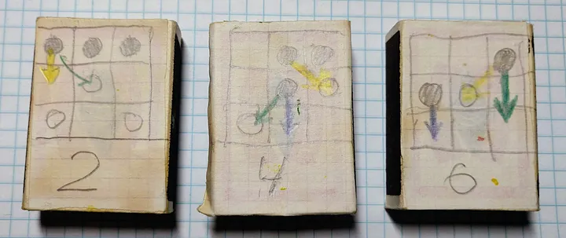
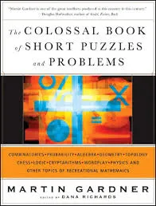
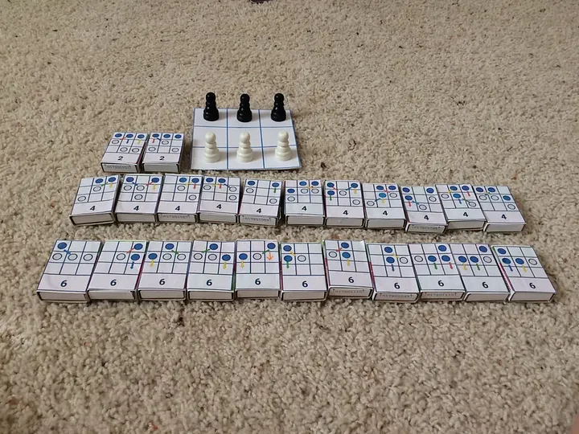

I made my first machine learning project when I was 12. I used 24 matchboxes, 55 (give or take) cherry pits, gouache paint, paper, scissors, glue, and colored pencils. That was all I needed to start working with machine learning in the 1980s.

My dad gave me a book by Martin Gardner describing a simple game and a machine for playing it. He called the game Hexapawn because it used just six pawns on a 3x3 board.

## The game and rules

The rules are simple. Here is how Martin Gardner describes them (https://gwern.net/doc/reinforcement-learning/model-free/1991-gardner-ch8amatchboxgamelearningmachine.pdf ):

Only two types of move are allowed:

(1) A pawn may advance straight forward one square to an empty square;
(2) a pawn may capture an enemy pawn by moving one square diagonally, left or right, to a square occupied by the enemy. The captured piece is removed from the board.

These are the same as pawn moves in chess, except that no double move, en passant capture, or promotion of pawns is permitted. The game is won in any of three ways:

1. By advancing a pawn to the third row.
1. By capturing all enemy pieces.
1. By achieving a position in which the enemy cannot move.

## The project

Creating a board and finding the pieces to play was the easy part. After that, I had to create the machine itself. Martin Gardner called it HER: Hexapawn Educable Robot.

The whole game never lasts longer than six moves. I, the human, was playing white, and the robot was playing black. So I had to give it (HER?) instructions for each even move.

I split twenty-four matchboxes into three groups: for moves 2, 4, and 6. Each box had a picture describing the position and the possible moves for that position for black. Each box contained several colored cherry pits according to the number of possible moves.

So, I had two boxes for the second move because there were two different positions after the first move by white (three if you count the symmetrical one). I had 11 boxes for the fourth move and another 11 boxes for the sixth move.

## Time to play and learn

Now, the game begins! You move your white pawn, take the matchbox with your current position, shake it, and pick one colored cherry pit from it (don’t look! Pick it randomly!). You make a move for the robot using the arrow of the cherry pit’s color and put it back in the box.

After six moves, either you or the robot wins.

Now begins the learning part. If the robot loses, you “punish” it by removing the colored pit responsible for the last move. For example, in box six above, if the last move for black was “green,” then black would lose. If that was the case, you remove the green pit from the box, leaving only the winning moves. If there is only one colored pit in the box, you “punish” the box responsible for the previous (fourth) move. That way, you ensure the robot never reaches the box with only one losing move.

Are the rules clear? Let’s start playing and teaching the machine!

The machine learns surprisingly fast. If you teach it correctly, it becomes invincible after 30–40 games. Don’t believe me? Try it!

## New generation

Forty years later, I found that book by Martin Gardner.

(https://www.amazon.com/Colossal-Book-Short-Puzzles-Problems/dp/0393061140/ ) and rebuilt the machine with my son.

Of course, we used a computer to create the board and move diagrams. We found colored beads in a nearby store (no need to paint cherry pits!). But the fun was the same!

My son published the instructions with the ready-to-use printouts you can download, cut, and glue on your matchboxes: https://www.instructables.com/Matchbox-Mini-Chess-Learning-Machine/

They look more polished now!

## Machine learning ideas

I hear you saying, “I thought it was a serious article about Machine Learning, but you are talking about child games with pencils and colored beads!” Let’s see if we can find the basic machine learning ideas in this game.

### Input and output

We begin with some input — the starting position. We must find the right output — the sequence of moves that will bring the machine to win the game. We must help the robot choose the right move at every possible position. Some moves are better than others, and we inform the robot about them using weights.

### Weights

In each position, we have several options for the next move. Depending on the game’s outcome, we can make certain move options more or less preferable for the next game (learning pass). Isn’t it similar to the weights we assign to certain neurons? Only in this case is it binary: you either leave the bead in the box (1) or remove it (0).

These days, we call it quantization, i.e., reducing the number of bits used by weights (e.g., from float32 to int8 and lower). In this case, each weight is exactly one bit, which tells us whether the bead is in the box or not.

### Reinforcement learning

Each time the machine gives you a wrong result, you adjust its weights. What is it, if not reinforcement learning? Environment, State, Agent, Action, Reward, right?

### Backpropagation

Remember what you must do if only one bead is left in the box responsible for the last move? You can’t leave it empty, so you must apply the Reward (or, rather, the punishment) to the box responsible for the previous move. And so on and so forth. It looks like backpropagation, doesn’t it?

## Going further

It’s pretty easy to play 30–40 games with the machine to make it invincible. Each game takes a few minutes, so we can achieve that result in less than an hour. But what if we could automate it? What if we could create a program to play the game and make two programs play against each other like they did with the Alpha Go program?

This sounds like a fun project that would be pretty easy to implement. But we are talking about ML and AI here, right? Why don’t we use AI to help us write this program?

I didn’t expect much when I entered the following prompt into ChatGPT.

>You are a Go programming expert. I will upload a file describing a simple chess-like game called Hexapawn. I want to write a program to implement this game. I must choose the data structures to store board positions and available (legal) moves in each position. Then, I have to implement the move and the whole game functions. Finally, I have to implement the learning procedure. Please help me develop this program. I have attached the PDF file with the game description.

And I uploaded the 15-page PDF that I linked at the very beginning.

I’ll tell you what happened next in the following article. Sorry, I couldn’t resist using this phrase. Also, ChatGPT told me that this article’s length is ideal and that I should stop writing immediately.

## Other works

I discovered that I'm not alone in making parallels between this simple game an Machine Learning principles.
After a quick search I found many interesting articles about using this game in teaching.
Here is a short list of articles.

**Pomona College** uses it in the [computer science labs](http://www.cs.pomona.edu/~kim/CSC062S07/labs/Lab6/HexAPawn.pdf)

**Proceedings of Machine Learning Research** directly addresses the idea of using the Hexapawn game in teaching Machine Learning: [Using Matchboxes to Teach the Basics of Machine Learning: an Analysis of (Possible) Misconceptions](https://proceedings.mlr.press/v170/marx22a/marx22a.pdf).

**Computd** calls it ["The accessible physical machine learning model"](https://computd.nl/hexapawn-accessible-machine-learning/).

**University of Wisconsin-Madison** recommends Hexapawn as the [Introduction to Machine Learning](https://education.mrsec.wisc.edu/hexapawn/) for students ages 11 and higher.

**Digital Business Development** calls it [a machine-learning teaching tool](https://dbd.au.dk/c/knowledge/tool-hexapawn-a-machine-learning-teaching-tool).
They implemented a version of the game in [JavaScript](https://bitbucket.org/aucbd/hexapawnts) but the game is not available online anymore.
Feel free to take the code and deploy it yourself.

**Mark Lawler** wrote a story about [showing this game to kids](https://mikesmathpage.wordpress.com/2017/09/03/intro-machine-learning-for-kids-via-martin-gardners-article-on-hexapawn/).
He even recorded several videos of them playing the game and explaining it.
